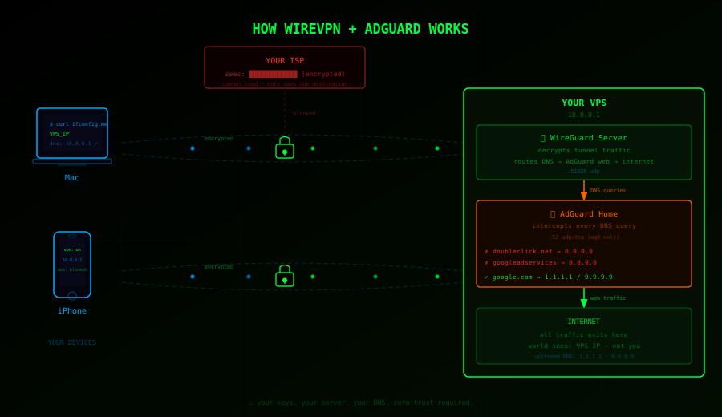

# WireGuard + AdGuard = WireVPN

```
  ██╗    ██╗██╗██████╗ ███████╗██╗   ██╗██████╗ ███╗   ██╗
  ██║    ██║██║██╔══██╗██╔════╝██║   ██║██╔══██╗████╗  ██║
  ██║ █╗ ██║██║██████╔╝█████╗  ██║   ██║██████╔╝██╔██╗ ██║
  ██║███╗██║██║██╔══██╗██╔══╝  ╚██╗ ██╔╝██╔═══╝ ██║╚██╗██║
  ╚███╔███╔╝██║██║  ██║███████╗ ╚████╔╝ ██║     ██║ ╚████║
   ╚══╝╚══╝ ╚═╝╚═╝  ╚═╝╚══════╝  ╚═══╝  ╚═╝     ╚═╝  ╚═══╝
```

> ⚠️ Your traffic belongs to you. Not your ISP. Not your government. Not big tech.
> Route around surveillance. Block the noise. Stay sovereign. Question everything.

Self-hosted WireGuard VPN + AdGuard Home DNS blocking — spin up your own private, ad-free tunnel on any VPS in minutes. No subscriptions. No third party logging your data. No trust required.



```
You → encrypted tunnel → YOUR server → internet
ISP sees: encrypted gibberish to one IP
World sees: your VPS, not you
Ads and trackers: blocked before they load
```

```
                             ┌───────────────────────────┐
  Mac ─────╮                 │         YOUR VPS           │
           │  WireGuard      │                            │
  Phone ───┼─────────────── ▶│  WireGuard  ──────────────── ▶  internet
           │  encrypted      │     │                      │
  Laptop ──╯  tunnel         │  AdGuard DNS               │
                             │  ad domains → NXDOMAIN ✗   │
                             └───────────────────────────┘

  ISP sees:   encrypted traffic to one IP — nothing else
  World sees: your VPS IP, not yours
  Ads:        blocked at DNS before any connection is made
```

---

## What makes this build unique?

Most WireGuard setup scripts on GitHub are one-shot installers — they run once, generate a config, and leave you to figure out everything else. They break on re-run, wipe your peers, have no error handling, and assume you already know what you're doing.

This is a complete managed system:

- **Re-entrant** — every script can be re-run safely without breaking existing state. Keys are preserved, peers aren't wiped, live config is backed up before any change.
- **AdGuard fully automated** — deployed and configured via REST API with no web UI wizard, no manual steps.
- **Peer management** — add or remove devices live with no WireGuard restart. QR code printed in terminal. Access revoked instantly.
- **Boot-safe** — network-wait wrapper ensures the VPN doesn't race with startup on macOS or Linux.
- **Fault-tolerant** — SSH pre-flight, IP collision prevention, key mismatch detection, architecture-aware binary selection (amd64/arm64/armv7).

The closest alternative is [Algo VPN](https://github.com/trailofbits/algo) — 10,000+ lines of Ansible/Python requiring a full toolchain install. This is ~1,300 lines of bash that runs on any Mac or Linux machine with a one-liner.

---

## Why self-host?

Commercial VPNs ask you to trust them. Why would you?

```
Commercial VPN:   You → their server → internet
                  They log everything. They comply with subpoenas.
                  You're paying someone else to surveil you.

Self-hosted:      You → your server → internet
                  You own the keys. You own the logs (there are none).
                  Zero trust required.
```

One caveat: you're still trusting your VPS provider. They can see your IP, connection times, and traffic volume — not the contents, but the metadata is real. That's an honest tradeoff worth knowing upfront.

Pick a provider that accepts anonymous payment, operates outside your jurisdiction, and has a no-logs policy. Mullvad VPS (pay with Monero, no account required) and 1984 Hosting (Iceland, strong privacy laws) get you much closer to zero trust than any commercial VPN can offer. See the provider table below.

## Threat model

This protects you from:
- ✓ ISP seeing your browsing traffic
- ✓ Network-level surveillance on public WiFi
- ✓ Ad networks correlating your IP
- ✓ Basic geo-restrictions

This does NOT protect you from:
- ✗ Your VPS provider (pick one you trust, pay anonymously if needed)
- ✗ Browser fingerprinting
- ✗ Being logged in to accounts that identify you
- ✗ Nation-state level adversaries

---

## What's in here

```
server_setup.sh     — run on your VPS (Ubuntu 24.04)
client_setup.sh     — run on your Mac or Linux machine
add_peer.sh         — add or remove devices from your VPN (run on your Mac)
adguard_setup.sh    — install AdGuard Home on your VPS for DNS-level ad blocking
adguard_client.sh   — update Mac configs to use AdGuard DNS
```

### Persistence — how it works

The `client_setup.sh` script automatically installs a boot daemon so your VPN reconnects every time your machine starts — no manual intervention needed.

**macOS** — installs a launchd daemon (`/Library/LaunchDaemons/com.wirevpn.startup.plist`) with a network-wait wrapper that holds off until your internet is up before connecting.

**Linux** — enables a systemd service (`wg-quick@client`) with `network-online.target` so WireGuard waits for network before starting.

Without this, your VPN dies on restart and you're exposed until you manually reconnect.

---

## What you need

- A VPS running Ubuntu 24.04 — see crypto-friendly providers in the Setup section below
- A Mac or Linux machine as your client
- 20 minutes

## Client OS support

```
macOS    ✓   auto-start via launchd
Linux    ✓   auto-start via systemd (apt / dnf / pacman)
Windows  ✗   not supported
```

---

## Setup

> **⚠️ Before destroying or rebuilding your VPS, always run `sudo wg-quick down /etc/wireguard/client.conf` on every connected device first. Nuking the VPS while the tunnel is active kills internet on all clients immediately.**

### 1. Spin up a VPS
Get a cheap Ubuntu 24.04 VPS anywhere. Vultr VC2-1C-1GB or similar is plenty.

**Pay with crypto to keep it clean.** These providers accept crypto and are privacy-friendly:

| Provider | Accepts | Notes |
|----------|---------|-------|
| [Vultr](https://vultr.com) | Bitcoin | Fast setup, good global locations, ~$5/mo |
| [Mullvad VPS](https://mullvad.net/en/servers) | Monero, Bitcoin | No account required, pay anonymously |
| [1984 Hosting](https://1984.hosting) | Bitcoin, Monero | Iceland-based, strong privacy laws |
| [FlokiNET](https://flokinet.is) | Monero, Bitcoin | Iceland/Romania, no-questions-asked policy |

**Monero (XMR) is better than Bitcoin for privacy** — Bitcoin transactions are traceable on-chain. Monero is untraceable by design. If anonymity matters, use Monero.

### 2. Run the server script on your VPS
```bash
ssh root@YOUR_SERVER_IP
bash <(curl -fsSL https://raw.githubusercontent.com/linkvectorized/wirevpn/main/server_setup.sh)
```

It will:
- Install WireGuard
- Generate server + client keys
- Configure routing and firewall
- Write your client config to `/etc/wireguard/client.conf`

**Re-running this script is safe.** If server keys already exist they are preserved — regenerating them would invalidate all connected clients.

### 3. Pull the client config to your Mac
```bash
mkdir -p ~/WireVPN
scp root@YOUR_SERVER_IP:/etc/wireguard/client.conf ~/WireVPN/client.conf
```

### 4. Run the client script on your Mac
```bash
curl -fsSL https://raw.githubusercontent.com/linkvectorized/wirevpn/main/client_setup.sh -o /tmp/client_setup.sh && bash /tmp/client_setup.sh
```

It will:
- Install WireGuard tools via Homebrew
- Fix config permissions
- Install a launchd daemon so VPN auto-connects on boot
- Connect the tunnel
- Verify your exit IP

### 5. Verify
```bash
curl ifconfig.me
# should return your VPS IP, not your home IP
```

---

## Adding and removing devices

Each device needs its own **peer** — unique keys and IP so multiple devices can connect simultaneously.

```bash
# Add a new device (generates a QR code to scan)
bash add_peer.sh phone
bash add_peer.sh laptop
bash add_peer.sh brian

# Remove a device (revokes access immediately, no restart needed)
bash add_peer.sh remove phone
```

Run this on your Mac. It will:
- Auto-detect your VPS IP from `client.conf`
- Generate a unique keypair and tunnel IP for the device
- Add the peer to your live WireGuard server (no restart)
- Pull the config to `~/Desktop/WireVPN/<name>.conf`
- Print a QR code — scan with the WireGuard iOS/Android app

Each device gets its own IP in the `10.0.0.x` range:
```
Mac Mini  → 10.0.0.2
iPhone    → 10.0.0.3
Laptop    → 10.0.0.4
...
```

Removing a peer revokes access instantly — they're kicked off the live tunnel and their keys are deleted from the server.

---

## AdGuard Home — DNS-level ad and tracker blocking

Block ads, trackers, and malware domains before they load — for every device already on your tunnel. No per-device changes needed.

AdGuard Home runs on your VPS and intercepts all DNS queries at `10.0.0.1`. When your iPhone or Mac asks "what's the IP for doubleclick.net?" AdGuard answers NXDOMAIN before the request ever leaves your network.

### 1. Run on your VPS (after server_setup.sh)
```bash
ssh root@YOUR_SERVER_IP
bash <(curl -fsSL https://raw.githubusercontent.com/linkvectorized/wirevpn/main/adguard_setup.sh)
```

It will:
- Download and install AdGuard Home binary
- Write a config with ad/tracker/malware blocklists
- Lock DNS to the WireGuard interface only — port 53 is never exposed publicly
- Start AdGuard as a systemd service
- Print a generated admin password — **save it**, it won't be shown again

**Re-running this script is safe.** If AdGuard is already configured, it updates the binary and restarts the service without touching your password or blocklist settings.

### 2. Run on your Mac
```bash
cd ~/Desktop/WireVPN
bash adguard_client.sh
```

It will:
- Update DNS in all your `.conf` files (client.conf, phone.conf, etc.) from `1.1.1.1` to `10.0.0.1`
- Back up originals before editing
- Reinstall configs to `/etc/wireguard/`
- Bounce the tunnel to pick up the new DNS
- Verify blocking is working

### 3. For other devices (iPhone, etc.)
Edit the WireGuard config on each device and change:
```
DNS = 1.1.1.1
```
to:
```
DNS = 10.0.0.1
```

Or use `bash add_peer.sh <name>` — after running `adguard_client.sh`, new peer configs will automatically use AdGuard DNS.

### Web UI
While connected to your VPN, open:
```
http://10.0.0.1:3000
```

The UI is only reachable through the tunnel — it's not exposed to the public internet.

### Verify it's working

**1. Check a known ad domain is blocked**
```bash
dig @10.0.0.1 doubleclick.net
```
Should return `0.0.0.0` in the answer section. That means AdGuard intercepted the DNS query and returned a null address instead of the real one — the ad server is unreachable before any connection is even attempted.

How `dig` works here:
- `dig` is a DNS lookup tool — it asks a DNS server "what's the IP for this domain?"
- `@10.0.0.1` tells it to ask *your* AdGuard instance specifically, not your system DNS
- A normal domain returns a real IP like `142.250.80.1`
- A blocked domain returns `0.0.0.0` (null) or NXDOMAIN — AdGuard is lying to the requester on purpose, making the domain effectively unreachable

**2. Confirm you're still routing through your VPS**
```bash
curl ifconfig.me
```
Should return your VPS IP, not your home IP.

**3. Open the web UI**
```bash
open http://10.0.0.1:3000
```
Shows live query stats, blocked domains, and filter list management. Only reachable while connected to your VPN.

### Blocklists included by default
- **AdGuard DNS filter** — ads, trackers, malware
- **EasyList** — display ads
- **EasyPrivacy** — tracking scripts

You can add more via the web UI under Filters → DNS blocklists.

---

## Useful commands

```bash
# Connect
sudo wg-quick up /etc/wireguard/client.conf

# Disconnect
sudo wg-quick down /etc/wireguard/client.conf

# Check status
sudo wg show

# Check your exit IP
curl ifconfig.me

# View logs (macOS)
cat /var/log/wirevpn.log

# View logs (Linux)
sudo journalctl -u wg-quick@client
```

## Harden SSH access (recommended)

By default your VPS uses password auth. Switch to SSH keys — much harder to brute force.

**1. Generate a key on your local machine (if you don't have one):**
```bash
ssh-keygen -t ed25519 -C "your-label"
```
Use a passphrase when prompted — if your key file is ever stolen, the attacker still can't use it.

**2. Copy your public key to the server:**
```bash
ssh-copy-id root@YOUR_SERVER_IP
```

**3. Test that key auth works:**
```bash
ssh root@YOUR_SERVER_IP
# should log in without asking for password
```

**4. Disable password auth entirely:**
```bash
sed -i 's/#PasswordAuthentication yes/PasswordAuthentication no/' /etc/ssh/sshd_config
systemctl restart sshd
```

After this, no one gets in without your private key — even if they know the root password.

---

## Troubleshooting

### Peer connected but no internet / tunnel not handshaking

If a device shows as connected in the WireGuard app but has no internet, or `wg show` on the VPS shows no handshake for a peer, the most likely cause is a **stale server public key** in the peer's config.

**Diagnose:**
```bash
# On VPS — check what public key WireGuard is actually using right now
wg show wg0 public-key

# Derive the public key from the key file
wg pubkey < /etc/wireguard/server_private.key
```

If those two values differ, your key files are stale.

**Fix:**
```bash
# On Mac — remove and re-add the affected peer
bash add_peer.sh remove phone
bash add_peer.sh phone
```

Rescan the QR on the device. `add_peer.sh` always reads the live key from `wg show` so newly generated configs are always correct.

---

### After rebooting your VPS

After a VPS reboot, WireGuard and AdGuard Home both start automatically (`systemctl enable` was set). You should not need to do anything.

**Verify everything came back:**
```bash
ssh root@YOUR_SERVER_IP
systemctl is-active wg-quick@wg0      # should say: active
systemctl is-active AdGuardHome        # should say: active
wg show                                # should show your peers
```

If a peer was connected before the reboot but shows no handshake after, the server public key didn't change — just reconnect the client app. If connectivity is still broken, see the stale key section above.

---

### wg0.conf got wiped or corrupted

If `wg0.conf` is ever damaged, `server_setup.sh` saves a live backup every time it runs:

```bash
# Restore from the live backup taken before any changes
cp /etc/wireguard/wg0.conf.live_backup /etc/wireguard/wg0.conf
systemctl restart wg-quick@wg0
```

The live backup is written from `wg showconf wg0` — it captures the real running state including all peers added via `add_peer.sh`, not just the initial config.

**If WireGuard is not running and the config is gone:**
```bash
# Check if a file backup exists
ls /etc/wireguard/

# wg0.conf.bak — copy of the config file from before last run
# wg0.conf.live_backup — snapshot of the live running config (most useful)
cp /etc/wireguard/wg0.conf.live_backup /etc/wireguard/wg0.conf
systemctl start wg-quick@wg0
```

If neither backup exists and WireGuard is running, dump the live config now before anything else:
```bash
wg showconf wg0 > /etc/wireguard/wg0.conf
```

---

### Peer shows `allowed ips: (none)` in wg show

This means the peer was added to WireGuard's keyring but has no IP assignment — usually from a partial or interrupted `add_peer.sh` run.

**Fix:**
```bash
# On Mac
bash add_peer.sh remove <name>
bash add_peer.sh <name>
```

If `remove` fails because the peer name isn't found, remove it manually on the VPS:
```bash
# Get the peer's public key
wg show wg0

# Remove the broken peer by its public key
wg set wg0 peer <PUBLIC_KEY> remove

# Also remove from wg0.conf (find and delete the [Peer] block for that key)
```

---

### Phone / device not connecting after server key change

If you ever end up with a new server public key (e.g. after restoring from a backup with different keys), every existing device config is invalid. The fix for each device:

**iPhone / Android:**
1. On your Mac: `bash add_peer.sh remove phone` then `bash add_peer.sh phone`
2. In WireGuard app: delete the old tunnel, tap `+` → Create from QR code → scan the new QR

**Mac:**
```bash
# Update client.conf on VPS (already done by server_setup.sh)
scp root@YOUR_SERVER_IP:/etc/wireguard/client.conf ~/Desktop/WireVPN/client.conf
sudo cp ~/Desktop/WireVPN/client.conf /etc/wireguard/client.conf
sudo wg-quick down /etc/wireguard/client.conf 2>/dev/null || true
sudo wg-quick up /etc/wireguard/client.conf
```

---

### AdGuard web UI unreachable (http://10.0.0.1:3000)

The web UI is only reachable **while connected to the VPN**. It is intentionally not exposed to the public internet.

```bash
# 1. Verify you're on the VPN
curl ifconfig.me
# Should return your VPS IP, not your home IP

# 2. Verify AdGuard is running on the VPS
ssh root@YOUR_SERVER_IP
systemctl is-active AdGuardHome

# 3. If it's down, restart it
systemctl restart AdGuardHome
```

---

### Internet not working after VPS is destroyed

> **⚠️ Always disconnect your VPN tunnel before destroying or rebuilding your VPS.**
> If you nuke the VPS while the tunnel is active, all traffic routes into nothing and every connected device loses internet instantly.

**Disconnect first, then destroy:**
```bash
sudo wg-quick down /etc/wireguard/client.conf
```

**If you already destroyed it and are stuck:**
```bash
# Try this first
sudo wg-quick down /etc/wireguard/client.conf

# If that hangs or errors, kill the process directly
sudo killall wireguard-go
```

**Also unload the boot daemon** or it will try to reconnect on next startup:
```bash
sudo launchctl unload /Library/LaunchDaemons/com.wirevpn.startup.plist
```

Your internet comes back immediately. Reconnect once your new VPS is ready.

---

### "WARNING: REMOTE HOST IDENTIFICATION HAS CHANGED"

Your VPS provider reused the same IP for a new server. Safe to fix:

```bash
ssh-keygen -R YOUR_SERVER_IP
```

Then SSH in again normally.

---

### Emergency: verify the full state of your server

Run this on the VPS to get a complete picture:

```bash
echo "=== WireGuard ===" && wg show
echo "=== Live public key ===" && wg show wg0 public-key
echo "=== Key file public key ===" && wg pubkey < /etc/wireguard/server_private.key
echo "=== AdGuard ===" && systemctl is-active AdGuardHome
echo "=== IP forwarding ===" && sysctl net.ipv4.ip_forward
echo "=== Firewall ===" && ufw status
echo "=== Backups ===" && ls -lh /etc/wireguard/*.bak /etc/wireguard/*.live_backup 2>/dev/null
```

Everything healthy looks like:
- `wg show` lists your peers with recent handshake times
- Both public key outputs match
- AdGuard: `active`
- IP forwarding: `net.ipv4.ip_forward = 1`
- UFW: `Status: active` with ports 51820/udp, 22 open

---


## Mobile setup (iOS / Android)

1. Install the **WireGuard** app (free, by WireGuard Development Team)
2. On your Mac run: `bash add_peer.sh phone` — it prints a QR code
3. In the app tap `+` → **Create from QR code** → scan → done

**Enable On-Demand (auto-connect without toggling manually):**

In the WireGuard iOS app:
- Open the tunnel → tap **Edit**
- Toggle on **On-Demand Activation**
- Choose: WiFi, cellular, or both

With On-Demand enabled your phone connects automatically whenever it's on the networks you selected — no manual toggle needed.

---

## Limitations

- IPv4 only — no IPv6 support
- macOS and Linux client only — no Windows support
- Multiple devices: use `bash add_peer.sh <name>` — each gets its own keys and IP

---

## License

MIT — free for everyone, forever. Use it, fork it, modify it, share it.

---

*Stay private. Question narratives. Build cool things.*

— [linkvectorized](https://github.com/linkvectorized)
