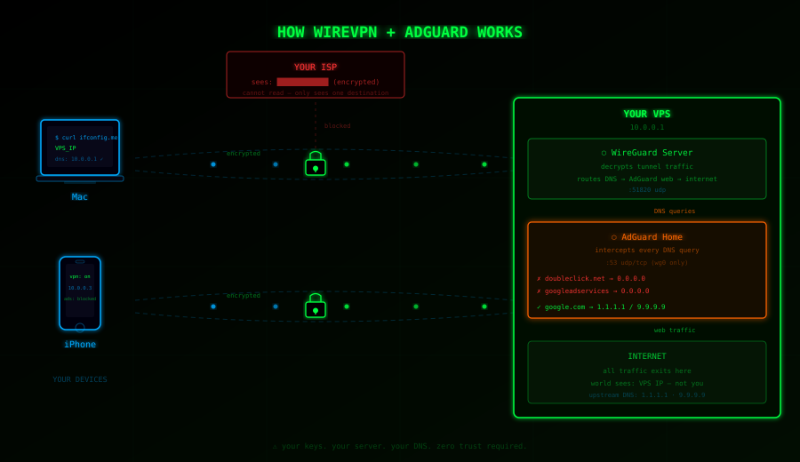

# WireGuard + AdGuard = WireVPN

```
  ██╗    ██╗██╗██████╗ ███████╗██╗   ██╗██████╗ ███╗   ██╗
  ██║    ██║██║██╔══██╗██╔════╝██║   ██║██╔══██╗████╗  ██║
  ██║ █╗ ██║██║██████╔╝█████╗  ██║   ██║██████╔╝██╔██╗ ██║
  ██║███╗██║██║██╔══██╗██╔══╝  ╚██╗ ██╔╝██╔═══╝ ██║╚██╗██║
  ╚███╔███╔╝██║██║  ██║███████╗ ╚████╔╝ ██║     ██║ ╚████║
   ╚══╝╚══╝ ╚═╝╚═╝  ╚═╝╚══════╝  ╚═══╝  ╚═╝     ╚═╝  ╚═══╝
```

> ⚠️ Your traffic belongs to you. Not your ISP. Not your government. Not big tech.
> Route around surveillance. Block the noise. Stay sovereign. Question everything.

Self-hosted WireGuard VPN + AdGuard Home DNS blocking — spin up your own private, ad-free tunnel on any VPS in minutes. No subscriptions. No third party logging your data. No trust required.



```
You → encrypted tunnel → YOUR server → internet
ISP sees: encrypted gibberish to one IP
World sees: your VPS, not you
Ads and trackers: blocked before they load
```

```
                             ┌───────────────────────────┐
  Mac ──────╮                │         YOUR VPS           │
            │  WireGuard     │                            │
  Linux ────┼───────────── ▶│  WireGuard  ──────────────── ▶  internet
            │  encrypted     │     │                      │
  Phone ────╯  tunnel        │  AdGuard DNS               │
                             │  ad domains → NXDOMAIN ✗   │
                             └───────────────────────────┘

  ISP sees:   encrypted traffic to one IP — nothing else
  World sees: your VPS IP, not yours
  Ads:        blocked at DNS before any connection is made
```

---

> **This is for people who already have a VPS.** Spinning one up takes 5–10 minutes and costs ~$5/month — see the provider table in the Setup section. Once you have a fresh Ubuntu 24.04 server, WireVPN handles everything else.

## What makes this build unique?

The smoothest WireGuard + AdGuard combo setup you'll find anywhere. Fully automated, zero manual config, works first time.

This is a complete managed system:

- **Re-entrant** — every script can be re-run safely without breaking existing state. Keys are preserved, peers aren't wiped, live config is backed up before any change.
- **AdGuard fully automated** — deployed and configured via REST API with no web UI wizard, no manual steps.
- **Peer management** — add or remove devices live with no WireGuard restart. QR code printed in terminal. Access revoked instantly.
- **Boot-safe** — network-wait wrapper ensures the VPN doesn't race with startup on macOS or Linux.
- **IPv6 leak protection** — IPv6 is disabled on all interfaces while the tunnel is up (fail-closed), restored on teardown. No v6 traffic escapes in cleartext.
- **Fault-tolerant** — SSH pre-flight, IP collision prevention, key mismatch detection, architecture-aware binary selection (amd64/arm64/armv7).

The closest alternative is [Algo VPN](https://github.com/trailofbits/algo) — 10,000+ lines of Ansible/Python requiring a full toolchain install. This is ~1,400 lines of bash that runs on any Mac or Linux machine with a one-liner.

---

## Why self-host?

Commercial VPNs ask you to trust them. Why would you?

```
Commercial VPN:   You → their server → internet
                  They log everything. They comply with subpoenas.
                  You're paying someone else to surveil you.

Self-hosted:      You → your server → internet
                  You own the keys. You own the logs (there are none).
                  Zero trust required.
```

One caveat: you're still trusting your VPS provider. They can see your IP, connection times, and traffic volume — not the contents, but the metadata is real. That's an honest tradeoff worth knowing upfront.

Pick a provider that accepts anonymous payment, operates outside your jurisdiction, and has a no-logs policy. Mullvad VPS (pay with Monero, no account required) and 1984 Hosting (Iceland, strong privacy laws) get you much closer to zero trust than any commercial VPN can offer. See the provider table below.

## Threat model

This protects you from:
- ✓ ISP seeing your browsing traffic
- ✓ Network-level surveillance on public WiFi
- ✓ Ad networks correlating your IP
- ✓ Basic geo-restrictions

This does NOT protect you from:
- ✗ Your VPS provider (pick one you trust, pay anonymously if needed)
- ✗ Browser fingerprinting
- ✗ Being logged in to accounts that identify you
- ✗ Nation-state level adversaries

---

## What's in here

```
server_setup.sh     — run on your VPS (Ubuntu 24.04)
client_setup.sh     — run on your Mac or Linux machine
mobile_peer.sh      — add phones/tablets (shows QR code) or remove any peer
adguard_setup.sh    — install AdGuard Home on your VPS for DNS-level ad blocking
wirevpn.sh          — the wirevpn CLI (installed to /usr/local/bin/wirevpn by client_setup.sh)
```

### Persistence — how it works

The `client_setup.sh` script automatically installs a boot daemon so your VPN reconnects every time your machine starts — no manual intervention needed.

**macOS** — installs a launchd daemon (`/Library/LaunchDaemons/com.wirevpn.startup.plist`) with a network-wait wrapper that holds off until your internet is up before connecting.

**Linux** — enables a systemd service (`wg-quick@client`) with `network-online.target` so WireGuard waits for network before starting.

Without this, your VPN dies on restart and you're exposed until you manually reconnect.

### IPv6 leak protection

`AllowedIPs = 0.0.0.0/0` routes IPv4 only. On any IPv6-capable network, v6 traffic would bypass the tunnel in cleartext — a silent leak most setups never notice.

WireVPN fails closed instead: while the tunnel is up, IPv6 is disabled on every network service (`networksetup -setv6off` on macOS, `sysctl net.ipv6.conf.all.disable_ipv6=1` on Linux). It's restored automatically on `wirevpn down` or shutdown, and the boot connector heals stale state at startup, so a crash or hard power loss can't leave IPv6 disabled.

Verify any time with:

```bash
networksetup -getinfo Wi-Fi | grep IPv6   # expect "IPv6: Off" while tunneled
```

Note: v6-only destinations (rare) are unreachable while the VPN is up — that's the point. Full v6 tunneling may come later if your VPS supports it.

### wirevpn CLI

`client_setup.sh` also installs a `wirevpn` command at `/usr/local/bin/wirevpn`:

```bash
sudo wirevpn up       # bring tunnel up with DNS verification
sudo wirevpn down     # tear tunnel down cleanly — stops the daemon, restores DNS
sudo wirevpn status   # show tunnel state, exit IP, and per-interface DNS
```

Always use `sudo wirevpn down` instead of raw `wg-quick down`. The raw command tears down the tunnel but leaves DNS pointing at your VPS (`10.0.0.1`), which kills all internet until you manually reset it. `wirevpn down` handles the full cleanup in one step.

---

## What you need

- A VPS running Ubuntu 24.04 — see crypto-friendly providers in the Setup section below
- A Mac or Linux machine as your client
- 20 minutes

## Client OS support

```
macOS    ✓   auto-start via launchd
Linux    ✓   auto-start via systemd (apt / dnf / pacman)
Windows  ✗   not supported
```

---

## Setup

> **⚠️ Before destroying or rebuilding your VPS, always run `sudo wirevpn down` on every connected device first. Nuking the VPS while the tunnel is active kills internet on all clients immediately.**

### 1. Spin up a VPS
Get a cheap Ubuntu 24.04 VPS anywhere. Vultr VC2-1C-1GB or similar is plenty.

**Pay with crypto to keep it clean.** These providers accept crypto and are privacy-friendly:

| Provider | Accepts | Notes |
|----------|---------|-------|
| [Vultr](https://vultr.com) | Bitcoin | Fast setup, good global locations, ~$5/mo |
| [Mullvad VPS](https://mullvad.net/en/servers) | Monero, Bitcoin | No account required, pay anonymously |
| [1984 Hosting](https://1984.hosting) | Bitcoin, Monero | Iceland-based, strong privacy laws |
| [FlokiNET](https://flokinet.is) | Monero, Bitcoin | Iceland/Romania, no-questions-asked policy |

**Monero (XMR) is better than Bitcoin for privacy** — Bitcoin transactions are traceable on-chain. Monero is untraceable by design. If anonymity matters, use Monero.

### 2. Run the server script on your VPS
```bash
ssh root@YOUR_SERVER_IP
bash <(curl -fsSL https://raw.githubusercontent.com/linkvectorized/wirevpn/main/server_setup.sh)
```

It will:
- Install WireGuard
- Generate server keys
- Configure routing and firewall

**Re-running this script is safe.** If server keys already exist they are preserved — regenerating them would invalidate all connected clients.

### 3. Run AdGuard on your VPS
```bash
bash <(curl -fsSL https://raw.githubusercontent.com/linkvectorized/wirevpn/main/adguard_setup.sh)
```

Installs AdGuard Home and locks DNS to `10.0.0.1` on the WireGuard interface. Every device that connects to the tunnel gets ad and tracker blocking automatically — no per-device config needed. Save the admin password it prints.

**Skip this step if you don't want ad blocking.** The VPN works fine without it.

### 4. Run the client script on your Mac or Linux machine
```bash
curl -fsSL https://raw.githubusercontent.com/linkvectorized/wirevpn/main/client_setup.sh -o /tmp/client_setup.sh && bash /tmp/client_setup.sh
```

It will prompt for your VPS IP and a device name, then:
- Register this device with your VPS (generates unique keys + IP)
- Install WireGuard tools
- Install a launchd daemon so VPN auto-connects on boot
- Connect the tunnel
- Verify your exit IP

> **⚠️ Never copy `client.conf` to another device.** For a second Mac/Linux machine run `client_setup.sh` on it directly. For phones use `mobile_peer.sh`. See [Adding and removing devices](#adding-and-removing-devices) below.

### 5. Verify
```bash
curl ifconfig.me
# should return your VPS IP, not your home IP
```

---

## Adding and removing devices

**Every device needs its own peer** — unique keys and IP. Never copy `client.conf` from one machine to another. Two devices sharing the same config causes conflicts and breaks the tunnel.

### Adding a Mac or Linux machine

Just run `client_setup.sh` directly on the new machine. If no config exists it will prompt you for your VPS IP and a device name, register itself, and connect — all in one step:

```bash
curl -fsSL https://raw.githubusercontent.com/linkvectorized/wirevpn/main/client_setup.sh -o /tmp/client_setup.sh && bash /tmp/client_setup.sh
```

### Adding a phone or tablet

> **First, install the WireGuard app on your phone:** [iOS App Store](https://apps.apple.com/us/app/wireguard/id1441195209) · [Google Play](https://play.google.com/store/apps/details?id=com.wireguard.android)

Phones can't run shell scripts, so you generate the peer on your Mac or Linux machine and scan the QR code:

```bash
curl -fsSL https://raw.githubusercontent.com/linkvectorized/wirevpn/main/mobile_peer.sh -o /tmp/mobile_peer.sh && bash /tmp/mobile_peer.sh phone
```

Replace `phone` with any name (`ipad`, `partner`, etc.). The script SSHes into your VPS, registers the peer, and prints a QR code. In the WireGuard app tap `+` → **Create from QR code** → scan → done.

**Enable On-Demand (iOS) — auto-connect without manually toggling:**
Open the tunnel → tap **Edit** → toggle on **On-Demand Activation** → choose WiFi, cellular, or both. Your phone will connect automatically on the networks you select.

### Removing a device

Run this on any Mac or Linux machine that has the VPN set up:

```bash
curl -fsSL https://raw.githubusercontent.com/linkvectorized/wirevpn/main/mobile_peer.sh -o /tmp/mobile_peer.sh && bash /tmp/mobile_peer.sh remove laptop
```

Replace `laptop` with whatever name you used. Revokes access instantly — the peer is kicked off the live tunnel and their keys are deleted from the server. No restart needed.

Each device gets its own IP in the `10.0.0.x` range:
```
Device 1 (first Mac/Linux)  → 10.0.0.2
Device 2 (laptop)           → 10.0.0.3
Device 3 (phone)            → 10.0.0.4
...
```

---

## AdGuard Home — DNS-level ad and tracker blocking

AdGuard Home runs on your VPS and intercepts every DNS query from every device on your tunnel. When your phone or Mac asks "what's the IP for doubleclick.net?" AdGuard returns NXDOMAIN — the ad server never loads, before any connection is even attempted. No per-device setup needed, ever.

### Web UI

While connected to your VPN, open:
```
http://10.0.0.1:3000
```

The UI is only reachable through the tunnel — it's not exposed to the public internet. From here you can see live query stats, blocked domains, and manage filter lists.

### Verify it's working

```bash
dig @10.0.0.1 doubleclick.net
```

A blocked domain returns `0.0.0.0` or NXDOMAIN. A normal domain returns a real IP. If you see `0.0.0.0` for `doubleclick.net`, AdGuard is working.

### Blocklists included by default
- **AdGuard DNS filter** — ads, trackers, malware
- **EasyList** — display ads
- **EasyPrivacy** — tracking scripts

Add more via the web UI under Filters → DNS blocklists.

---

## Harden SSH access (recommended)

By default your VPS uses password auth. Switch to SSH keys — much harder to brute force.

**1. Generate a key on your local machine (if you don't have one):**
```bash
ssh-keygen -t ed25519 -C "your-label"
```
Use a passphrase when prompted — if your key file is ever stolen, the attacker still can't use it.

**2. Copy your public key to the server:**
```bash
ssh-copy-id root@YOUR_SERVER_IP
```

**3. Test that key auth works:**
```bash
ssh root@YOUR_SERVER_IP
# should log in without asking for password
```

**4. Disable password auth entirely:**
```bash
sed -i 's/#PasswordAuthentication yes/PasswordAuthentication no/' /etc/ssh/sshd_config
systemctl restart sshd
```

After this, no one gets in without your private key — even if they know the root password.

---

## TROUBLESHOOTING

### Useful commands

```bash
# Connect
sudo wirevpn up

# Disconnect (restores DNS cleanly — do not use wg-quick down directly)
sudo wirevpn down

# Status — tunnel state, exit IP, DNS per interface
sudo wirevpn status

# View logs (macOS)
cat /var/log/wirevpn.log

# View logs (Linux)
sudo journalctl -u wg-quick@client
```

### Peer connected but no internet / tunnel not handshaking

If a device shows as connected in the WireGuard app but has no internet, or `wg show` on the VPS shows no handshake for a peer, the most likely cause is a **stale server public key** in the peer's config.

**Diagnose:**
```bash
# On VPS — check what public key WireGuard is actually using right now
wg show wg0 public-key

# Derive the public key from the key file
wg pubkey < /etc/wireguard/server_private.key
```

If those two values differ, your key files are stale.

**Fix:**
```bash
# On Mac — remove and re-add the affected peer
bash mobile_peer.sh remove phone
bash mobile_peer.sh phone
```

Rescan the QR on the device. `mobile_peer.sh` always reads the live key from `wg show` so newly generated configs are always correct.

---

### After rebooting your VPS

After a VPS reboot, WireGuard and AdGuard Home both start automatically (`systemctl enable` was set). You should not need to do anything.

**Verify everything came back:**
```bash
ssh root@YOUR_SERVER_IP
systemctl is-active wg-quick@wg0      # should say: active
systemctl is-active AdGuardHome        # should say: active
wg show                                # should show your peers
```

If a peer was connected before the reboot but shows no handshake after, the server public key didn't change — just reconnect the client app. If connectivity is still broken, see the stale key section above.

---

### wg0.conf got wiped or corrupted

If `wg0.conf` is ever damaged, `server_setup.sh` saves a live backup every time it runs:

```bash
# Restore from the live backup taken before any changes
cp /etc/wireguard/wg0.conf.live_backup /etc/wireguard/wg0.conf
systemctl restart wg-quick@wg0
```

The live backup is written from `wg showconf wg0` — it captures the real running state including all peers added via `mobile_peer.sh`, not just the initial config.

**If WireGuard is not running and the config is gone:**
```bash
# Check if a file backup exists
ls /etc/wireguard/

# wg0.conf.bak — copy of the config file from before last run
# wg0.conf.live_backup — snapshot of the live running config (most useful)
cp /etc/wireguard/wg0.conf.live_backup /etc/wireguard/wg0.conf
systemctl start wg-quick@wg0
```

If neither backup exists and WireGuard is running, dump the live config now before anything else:
```bash
wg showconf wg0 > /etc/wireguard/wg0.conf
```

---

### Peer shows `allowed ips: (none)` in wg show

This means the peer was added to WireGuard's keyring but has no IP assignment — usually from a partial or interrupted `mobile_peer.sh` run.

**Fix:**
```bash
# On Mac
bash mobile_peer.sh remove <name>
bash mobile_peer.sh <name>
```

If `remove` fails because the peer name isn't found, remove it manually on the VPS:
```bash
# Get the peer's public key
wg show wg0

# Remove the broken peer by its public key
wg set wg0 peer <PUBLIC_KEY> remove

# Also remove from wg0.conf (find and delete the [Peer] block for that key)
```

---

### Phone / device not connecting after server key change

If you ever end up with a new server public key (e.g. after restoring from a backup with different keys), every existing device config is invalid. The fix for each device:

**iPhone / Android:**
1. On your Mac: `bash mobile_peer.sh remove phone` then `bash mobile_peer.sh phone`
2. In WireGuard app: delete the old tunnel, tap `+` → Create from QR code → scan the new QR

**Mac:**
```bash
# Update client.conf on VPS (already done by server_setup.sh)
scp root@YOUR_SERVER_IP:/etc/wireguard/client.conf ~/Desktop/WireVPN/client.conf
sudo cp ~/Desktop/WireVPN/client.conf /etc/wireguard/client.conf
sudo wirevpn down 2>/dev/null || true
sudo wirevpn up
```

---

### AdGuard web UI unreachable (http://10.0.0.1:3000)

The web UI is only reachable **while connected to the VPN**. It is intentionally not exposed to the public internet.

```bash
# 1. Verify you're on the VPN
curl ifconfig.me
# Should return your VPS IP, not your home IP

# 2. Verify AdGuard is running on the VPS
ssh root@YOUR_SERVER_IP
systemctl is-active AdGuardHome

# 3. If it's down, restart it
systemctl restart AdGuardHome
```

---

### Internet not working after VPS is destroyed

> **⚠️ Always disconnect your VPN tunnel before destroying or rebuilding your VPS.**
> If you nuke the VPS while the tunnel is active, all traffic routes into nothing and every connected device loses internet instantly.

**Disconnect first, then destroy:**
```bash
sudo wirevpn down
```

**If you already destroyed it and are stuck:**
```bash
# Try this first — tears down the tunnel, stops the daemon, restores DNS
sudo wirevpn down

# If that hangs or errors, kill the process directly
sudo killall wireguard-go
```

Your internet comes back immediately. Reconnect once your new VPS is ready.

---

### DNS broken after reboot — all requests hanging (macOS)

**Symptom:** After a reboot, `curl`, `dig`, and HTTPS all hang. `ping 8.8.8.8` works fine. `dig @8.8.8.8 google.com` works but `dig google.com` hangs.

**Cause:** `wg-quick` sets system DNS to `10.0.0.1` (through the tunnel) on every network interface. If the Mac rebooted without the tunnel coming down cleanly, that DNS setting persists — pointing at `10.0.0.1` which is unreachable without the tunnel active.

**Quick fix:**
```bash
# Reset DNS on all interfaces back to DHCP
sudo networksetup -setdnsservers Wi-Fi empty
sudo networksetup -setdnsservers Ethernet empty
sudo networksetup -setdnsservers "Thunderbolt Bridge" empty

# Flush the cache
sudo dscacheutil -flushcache
sudo killall -HUP mDNSResponder
```

If you're not sure which interfaces you have:
```bash
networksetup -listallnetworkservices
# run the -setdnsservers empty command for each one listed
```

DNS comes back immediately. Your tunnel is still broken (that's expected — the VPN wasn't connected), but your machine is now fully functional without it.

**This is now handled automatically** — the boot daemon detects stale VPN DNS at startup and clears it before bringing the tunnel up. You should only need the manual fix above if you're on an older install (before this was added).

---

### "WARNING: REMOTE HOST IDENTIFICATION HAS CHANGED"

Your VPS provider reused the same IP for a new server. Safe to fix:

```bash
ssh-keygen -R YOUR_SERVER_IP
```

Then SSH in again normally.

---

### Emergency: verify the full state of your server

Run this on the VPS to get a complete picture:

```bash
echo "=== WireGuard ===" && wg show
echo "=== Live public key ===" && wg show wg0 public-key
echo "=== Key file public key ===" && wg pubkey < /etc/wireguard/server_private.key
echo "=== AdGuard ===" && systemctl is-active AdGuardHome
echo "=== IP forwarding ===" && sysctl net.ipv4.ip_forward
echo "=== Firewall ===" && ufw status
echo "=== Backups ===" && ls -lh /etc/wireguard/*.bak /etc/wireguard/*.live_backup 2>/dev/null
```

Everything healthy looks like:
- `wg show` lists your peers with recent handshake times
- Both public key outputs match
- AdGuard: `active`
- IP forwarding: `net.ipv4.ip_forward = 1`
- UFW: `Status: active` with ports 51820/udp, 22 open

---


## Limitations

- IPv4 only — no IPv6 support
- macOS and Linux client only — no Windows support
- Multiple devices: use `bash mobile_peer.sh <name>` — each gets its own keys and IP

---

## License

MIT — free for everyone, forever. Use it, fork it, modify it, share it.

---

*Stay private. Question narratives. Build cool things.*

— [linkvectorized](https://github.com/linkvectorized)
